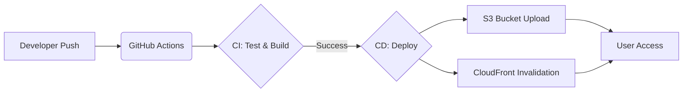

# c4pang-front CI/CD 구축 가이드

이 문서는 `c4pang-front` 프로젝트에 적용된 CI/CD 파이프라인의 구조와 설정, 그리고 운영 방법을 설명합니다. .


## 1. 개요 및 아키텍처

이 프로젝트는 **GitHub Actions**를 사용하여 자동화된 빌드 및 배포 파이프라인을 구축했습니다.  
Kubernetes(Container) 대신 **AWS S3(정적 호스팅)와 CloudFront(CDN)**를 활용하여 프론트엔드 리소스를 배포하는 방식을 채택했습니다.

### 배포 흐름도


---

## 2. CI/CD 파이프라인 상세

파이프라인 설정 파일: `.github/workflows/ci.yml`

### Trigger (실행 조건)
- **CI (검증)**: `main`, `develop`, `release/**`, `feature/**` 브랜치에 Push 또는 PR 발생 시
- **CD (배포)**: `main` 브랜치에 Push 발생 시 (CI 통과 후 실행)

### 단계별 작업 내용

#### 1. Continuous Integration (CI)
코드의 품질을 검증하고 빌드 아티팩트를 생성합니다.
1.  **Checkout**: 최신 코드를 내려받습니다.
2.  **Setup Node.js**: Node.js v20 환경을 구성하고 의존성 캐싱을 적용합니다.
3.  **Install Dependencies**: `npm ci`로 `package-lock.json` 기반의 정확한 의존성을 설치합니다.
4.  **Lint Check**: `npm run lint`로 코드 스타일 및 잠재적 오류를 검사합니다.
5.  **Unit Test**: `npm run test:run`으로 단위 테스트(Vitest)를 수행하여 로직 무결성을 검증합니다.
6.  **Build**: `npm run build`로 Next.js 프로젝트를 정적 파일로 빌드합니다. (`out/` 디렉토리 생성)
7.  **Artifact Upload**: 빌드된 `out/` 폴더를 다음 단계(CD)로 전달하기 위해 임시 저장합니다.

#### 2. Continuous Deployment (CD)
검증된 아티팩트를 실제 운영 환경에 배포합니다.
1.  **Artifact Download**: CI 단계에서 생성된 빌드 결과물을 다운로드합니다.
2.  **AWS Authentication**: OIDC(OpenID Connect) 방식을 사용하여 안전하게 AWS 권한을 획득합니다.
3.  **S3 Sync**: 변경된 파일만 S3 버킷에 동기화합니다. (삭제된 파일은 버킷에서도 제거)
4.  **CloudFront Invalidation**: CDN 캐시를 무효화하여 사용자가 즉시 최신 버전을 볼 수 있게 합니다.

---

## 3. 주요 설정 변경 사항

### Next.js 설정 (`next.config.js`)
S3 정적 웹 호스팅을 위해 **Static Export** 모드를 활성화했습니다.
```javascript
const nextConfig = {
  output: 'export', // 필수: 정적 파일(HTML/CSS/JS) 생성 모드
  images: {
    unoptimized: true, // 필수: Node.js 이미지 최적화 서버 부재로 인한 설정
    // ...
  },
  // ...
}
```

### 테스트 코드 수정 (`*.test.ts`, `*.test.tsx`)
CI 파이프라인의 안정적인 통과를 위해 일부 테스트 코드를 수정했습니다.  
**주의: 이는 서비스 로직(비즈니스 로직)에는 전혀 영향을 주지 않으며, 오직 테스트 환경의 모킹(Mocking) 및 타입 검증을 위한 수정입니다.**
- API 모듈 Mocking 방식 개선 (`vi.mock` 설정)
- 테스트 데이터 타입 정의 보완 (`fragrance`, `season` 등 선택적 속성 추가)
- 접근성 테스트 셀렉터 개선 (`getByRole` 사용)

---

## 4. 환경 변수 및 Secrets 설정

GitHub Repository의 `Settings > Secrets and variables > Actions`에 다음 값들이 설정되어야 합니다.

| Secret 이름 | 설명 | 비고 |
| --- | --- | --- |
| `AWS_ROLE_TO_ASSUME` | GitHub Actions가 사용할 AWS IAM Role ARN | OIDC 신뢰 관계 설정 필요 |
| `AWS_REGION` | AWS 리전 코드 (예: `ap-northeast-2`) | |
| `S3_BUCKET_NAME` | 정적 파일이 업로드될 S3 버킷 이름 | |
| `CLOUDFRONT_DISTRIBUTION_ID` | 캐시 무효화를 수행할 CloudFront ID | |

---

## 5. 운영 가이드

### 배포 방법
1.  기능 개발 후 `develop` 또는 `feature` 브랜치에 푸시합니다. (자동으로 CI 수행)
2.  CI가 통과하면 `main` 브랜치로 Pull Request를 생성하고 병합(Merge)합니다.
3.  `main` 브랜치 병합 시 자동으로 **빌드 및 배포(CD)**가 진행됩니다.

### 배포 실패 시 확인 사항
- **Actions 탭 확인**: 어느 단계(Build, Test, Deploy)에서 실패했는지 로그를 확인합니다.
- **테스트 실패**: 로컬에서 `npm run test:run`을 실행하여 동일한 오류가 발생하는지 확인합니다.
- **권한 오류**: AWS IAM Role의 권한(S3 쓰기, CloudFront 무효화)이 올바른지 확인합니다.
